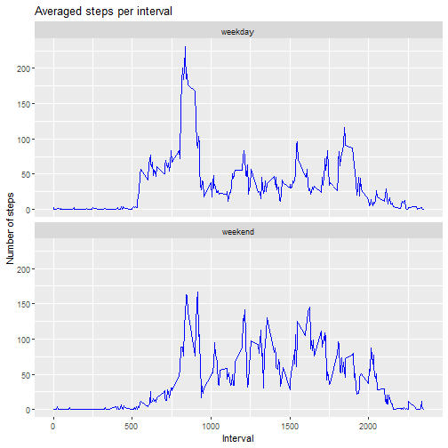

REPRODUCIBLE RESEARCH: Peer Assessment 1
========================================


## Loading and processing the data

The data is assigned to an object called *data* as a data frame.


``` r
data <- read.csv("./repdata_data_activity/activity.csv")
```


## What is mean total number of steps taken per day?

The total number of steps taken by day is assigned to an object called *day_steps*,
by using *tapply* function.


``` r
day_steps <- tapply(data$steps, data$date, sum)
```


Histogram plotted with *hist* function. In order to calculate the mean and median of
the total number of steps taken per day, NAs were dropped. 


``` r
hist(day_steps, 
     main = "Histogram of steps taken by day", 
     xlab = "Number of steps")
```


``` r
mean1 <- mean(day_steps, na.rm = TRUE)
median1 <- median(day_steps, na.rm = TRUE)
```


The mean is 10766.19 and the median is 10765.


## What is the average daily activity pattern?

The average number of steps taken, averaged across all days for each interval, was
assigned to the data frame *steps_per_int* using *dplyr*. 


``` r
library(dplyr)
steps_per_int <- data %>%
        group_by(interval) %>%
        summarise(avg_steps = mean(steps, na.rm = TRUE))
```


Here is a time series plot of the average number of steps taken at each interval
across all days, followed by the interval that contains the maximum number of steps.


``` r
library(ggplot2)
ggplot(steps_per_int, aes(x = interval, y = avg_steps)) +
              geom_line(color = "blue") + 
              labs(title = "Averaged steps per interval across all days",
                   x = "Interval",
                   y = "Number of steps") 
```


``` r
max_int <- steps_per_int %>% 
           filter(avg_steps == max(avg_steps)) %>% # getting the interval with 
           select(interval)                        # maximum steps value
```


The 5-minute interval that contains the maximum number of steps is 835.


## Imputing missing values

First the total number of missing values in the dataset is calculated.


``` r
na <- sum(is.na(data$steps))
```


There are 2304 missing values. 

Filling in all of the missing values was done by using the mean for that 5-minute 
interval with no steps value. By this it was created another data frame called 
*imputed_data*.


``` r
imputed_data <- data %>% 
        mutate(filled_steps = ifelse(is.na(steps), steps_per_int$avg_steps, steps))

sum(is.na(imputed_data$filled_steps)) # checking if there is still any NA
```

```
## [1] 0
```


Here is the histogram plotted now with the imputed data, followed by its mean and
median.


``` r
new_day_steps <- tapply(imputed_data$filled_steps, 
                        imputed_data$date, sum) # total number of steps per day

hist(new_day_steps, 
     main = "New histogram of steps taken by day",
     xlab = "Number of steps")
```


``` r
mean2 <- mean(new_day_steps)
median2 <- median(new_day_steps)
```


The new mean is 10766.19 and the new median is 10766.19.

Previously, the median and the mean were very close but were not identical. We can 
see now that the median equals to the mean, because the mean of steps by interval 
was used for filling in the missing values of steps. By doing this, the center bar 
of the histogram increased, but it did not affect its deviation pattern. 


## Are there differences in activity patterns between weekdays and weekends?

Now it is created a factor variable in *imputed_data* dataset called *wd*, which 
has two levels: "weekday" and "weekend". 


``` r
Sys.setlocale("LC_TIME", "en_US.UTF-8") # setting up the locale for English 
                                        # weekday names
```


``` r
imputed_data$date <- as.Date(imputed_data$date) # converting dates to date format
days <- weekdays(imputed_data$date) # storing dates as weekdays 

imputed_data <- imputed_data %>%
        mutate(wd = ifelse(
               days %in% c("Saturday", "Sunday"), 
               "weekend", "weekday"))
```


In order to make a panel plot for weekdays and weekend days, first we have to create
a data frame that groups the created factor variable and the intervals. This new data
frame is assigned to an object called *wd_steps*. 


``` r
wd_steps <- imputed_data %>%
        group_by(wd, interval) %>%
        summarise(avg_steps = mean(filled_steps))
```


And now we plot the average number of steps taken by "day type" for each interval.


``` r
ggplot(wd_steps, aes(x = interval, y = avg_steps)) +
              geom_line(color = "blue") + 
              facet_wrap(~ wd, ncol = 1) + 
              labs(title = "Averaged steps per interval",
                   x = "Interval",
                   y = "Number of steps")
```


